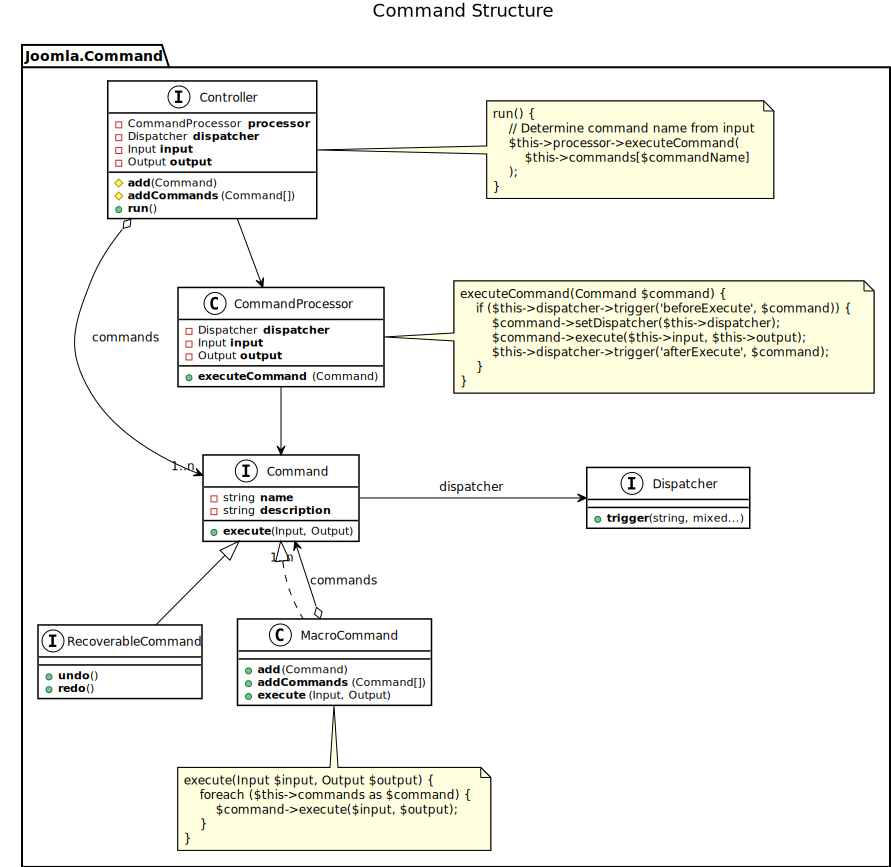
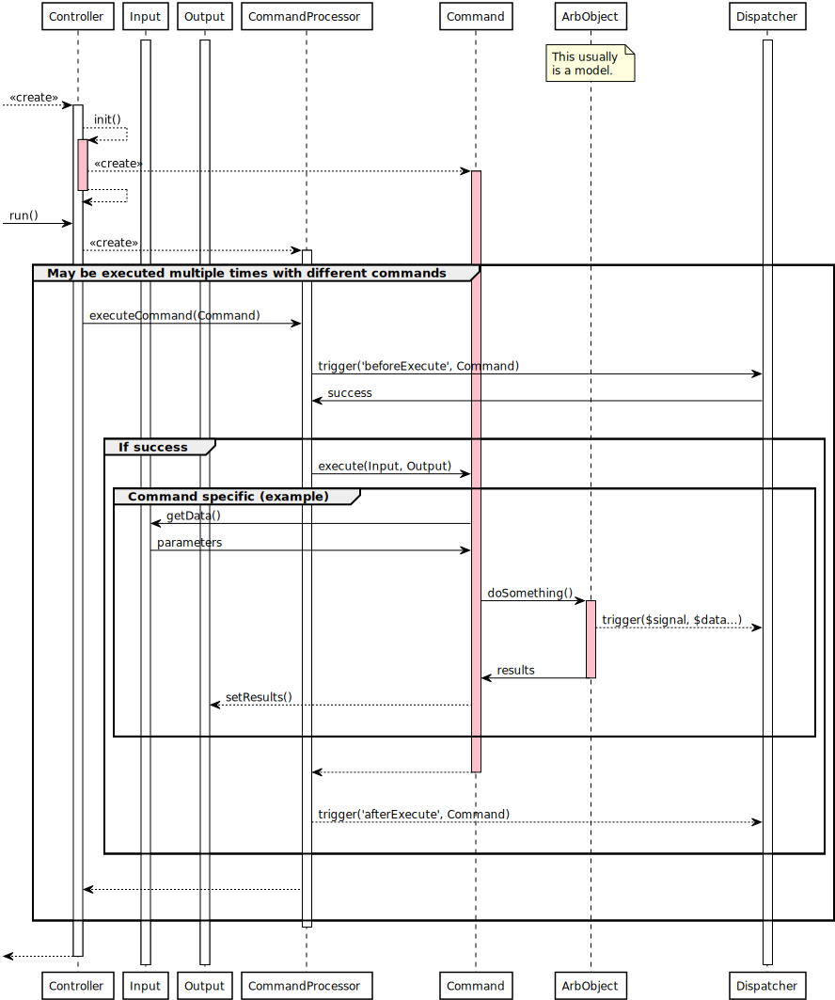

**Commands** are going to replace the controllers of Joomla! < 4.0.
Each command implements a single task, that can be addressed from arbitrary channels.

A generic **Controller** will gather the available commands for a given domain (usually a component),
identify the requested command, and execute it.
The structure is illustrated by the following diagram:

When the **Controller** is instantiated, it creates the **Command** objects for the current component.
When it is asked to run, it creates a **CommandProcessor**, which will handle the execution of the command.
Just before the command is executed, the processor triggers the `beforeExecute` event.

On the `beforeExecute` event, an ACL plugin could check, whether or not the current user is permitted to execute the command.
The **Command** and the component, it belongs to, can (and should) be completely ACL agnostic.
However, the **Command** is covered by the ACL plugin due to the **CommandProcessor**, as any other command is.

Since the **Command** knows everything it need to execute, an arbitrary class can be used as a model.
There is no limitation.
For example, JImage functions could get accessible directly using commands.
For **Model**s with a well defined common interface, generic **Command**s can be used.

The **Command** gets its data from the **Input** object.
It may or may not trigger its own events and call arbitrary library methods, which in turn may trigger standardized events.
The results of the operation are collected in an **Output** object.

When the **Command** returns to the **CommandProcessor**, the latter triggers the `afterExecute` event,
and gives control back to the **Controller**.

The following sequence diagram shows the control flow:

