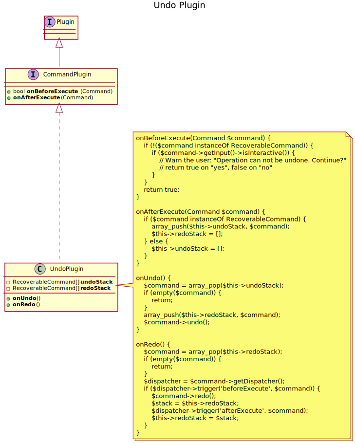
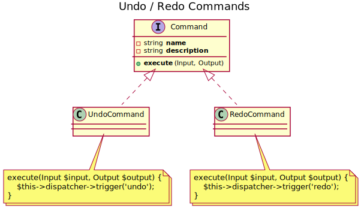

With the new architecture, it is possible to provide a global undo mechanism.
 
Since the execution of any **Command** is surrounded by the events `beforeExecute` and `afterExecute`, a simple **Plugin**
will do the job:

The **Plugin** manages an undo and a redo stack to store the **Command**s.
If it encounters a **Command**, that is not a **RecoverableCommand**, the undo stack is cleared.
 
In order to perform an **Undo** or a **Redo**, two **Command**s are needed:

