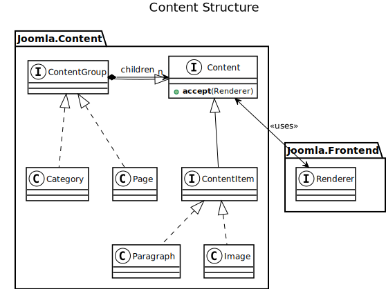

## Content Structure

**Content** is implemented using the Composite pattern. What ios now known as "Categories" and "Articles", 
all becomes just **Content**, which may or may not have several child content elements.

