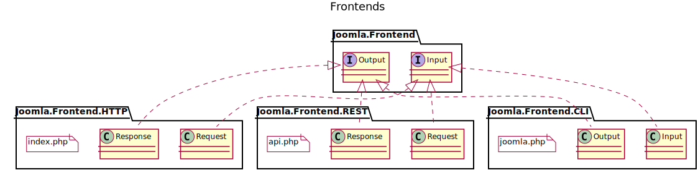

## Frontend Structure

Each **Channel** has its own **Frontend**, which is responsible for abstracting the communication for the rest of the application.
The diagram shows three different **Frontend**s.
There could be many others, though.

For simplicity's sake, the diagram shows only the **EntryPoint** script and the I/O classes.
The **Frontend**s encapsulate everything that is **Channel** dependent, so they are much more complex.

### HTTP Frontend

This is mostly the HTML **View** from Joomla! < 4.0.
It retrieves the **Request** data and provides it in a **Channel** independent form.
The HTTP **Frontend** handles all the HTML rendering, module gathering, and other things we use to see in the CMS as a web application.
Different **Renderer**s can be used to output HTML with jQuery, HTML with MooTools, PDF, CSV, ... you name it.

### REST Frontend

This is mostly the JSON **View** from Joomla! < 4.0.
It retrieves the **Request** data and provides it in a **Channel** independent form.
The REST **Frontend** formats the result accordingly.

### CLI Frontend

The command line options and arguments are provided in a **Channel** independent form in an **Input** object.
It echoes or stores the resulting data, depending on default configuration or command line switches.
